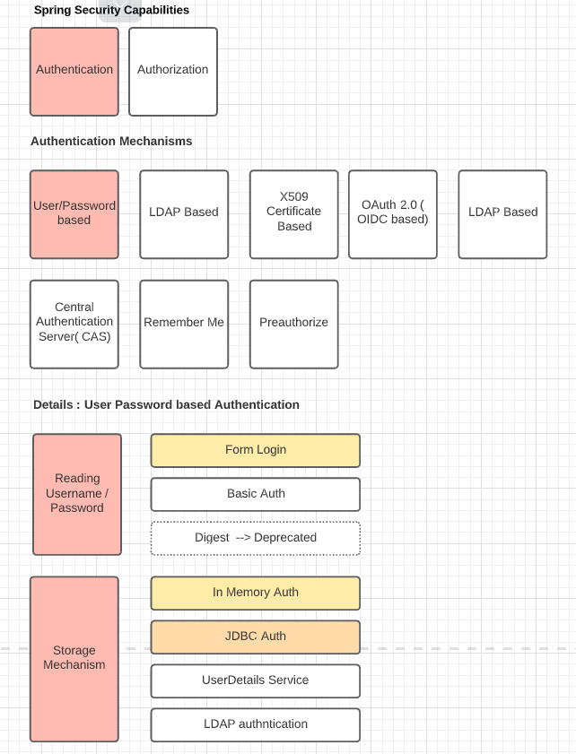

# JDBC authentication 
## Video Tutorial
Java Brains https://www.youtube.com/watch?v=LKvrFltAgCQ&list=PLqq-6Pq4lTTYTEooakHchTGglSvkZAjnE&index=7 

## We want to build 
* Form Based 
* JDBC auhentication  ( can eb migrated to JDBC - Persistant DB authentication) with Inmemory DB

## Where Does it stand Spring Security Big Picture 

### Pre-read
* https://docs.spring.io/spring-security/site/docs/current/reference/html5/#servlet-authentication   
* https://www.baeldung.com/spring-security-jdbc-authentication



### Spring security Feature Matrix
* [ ] Authorization 
* [x] _**Authentication**_
    * LDAP
    * X509 Certifiate
    * OAuth 2.0 ODIC
    * Central Authentication Service (CAS)
    * Remember Me
    * Preauthorize
    * [x] _**Username / Password based**_  
* [x] Username / PAssword based <br>
Following aspects are to be considered 
    * Reading Username / Pass
        *  [x] _**Form based**_
        *  Basic auth 
        *  Digest ( Deprecared) 
    * Storage Mechanism 
        * In memory DB        
        * [x] _**JDBC based**_ 
            * [x] _**In memory DB**_
            * Persistance DB
        * User Service 
        * LDAP 

## Important Steps 
We want to enable _Form Authentication_ with a JDBC In memory storage . 
### Dependencies
Following dependency is added
````xml
		<dependency>
			<groupId>com.h2database</groupId>
			<artifactId>h2</artifactId>
			<scope>runtime</scope>
		</dependency>
````
### Configurations
Following ocnfigurations need to be done in `ApplicationSecurityConfig`which extends `WebSecurityConfigurerAdapter`
#### Form Authentication 
We need to tell our application that it should enforce Form Authentication on all HTTP calls
````java
@Override
	protected void configure(HttpSecurity http) throws Exception {
		
		http.authorizeRequests()
		        .antMatchers("/admin").hasRole("ADMIN")
		        .and().formLogin() ;
    }
````

#### Storage Config
1. We need to autowire a Data source object
2. We need to configure JDBC authentication provider and tell it to the  `AuthenticationManager` using parameter `AuthenticationManagerBuilder`
````java
@Autowired
PasswordEncoder passwordEncoder;

@Override
	protected void configure(AuthenticationManagerBuilder auth) throws Exception {

		auth.jdbcAuthentication().dataSource(dataSource).withDefaultSchema()
				.withUser(User.withUsername("user").password(passwordEncoder.encode("pass"))
						.roles("USER"))
				.withUser(User.withUsername("admin").password(passwordEncoder.encode("pass"))
						.roles("ADMIN")) ;

	}
````
By default Spring Boot will create `in memory` H2 DB. 
By doing so this much we have implemeted JDBC In Memory persistance based + Form based authentication. 

#### Application properties for storage
 No explicit property is nedeed for the default settings. 

## Details into storage 
* We are using in Memory DB ; so we everytime we restart teh data related to user Details are lost 
* In thid context we nees 2 tables to store the `UserDetails`
    * AUTHORITIES
        * USERNAME
        * AUTHORITY
    * USERS
        * USERNAME
        * PASSWORD
        * ENABLED
* These schemas are well defined in Spring , and the autowired datasource will contain these tables. Schema details can be found at  https://docs.spring.io/spring-security/site/docs/current/reference/html5/#servlet-authentication-jdbc-schema  

* We are not using any User Default service; the users are created statically by the above method 
* This approach is not good for real productive apps

We want to look into the Default H2 Data base. For that we need to do following steps 
### Application Properties 
We need to set some configurations specific to H2

````properties 
spring.datasource.url=jdbc:h2:mem:testdb
#spring.datasource.url=jdbc:h2:file:/data/demo
spring.datasource.driverClassName=org.h2.Driver
spring.datasource.username=sa
spring.datasource.password=password
spring.jpa.database-platform=org.hibernate.dialect.H2Dialect


#H2 Console specific Settings
spring.h2.console.enabled=true
spring.h2.console.settings.trace=true
spring.h2.console.settings.web-allow-others=false

```` 
Following points to note
* the url for in memory datasource `jdbc:h2:mem:testdb` ; there is a different url for persistent database
* username and password are the DB admin credential 
* we are enabling the default H2 DB console ; using this endpoint we can look into the DB

### Configurations
Following ocnfigurations need to be done in `ApplicationSecurityConfig`which extends `WebSecurityConfigurerAdapter` which will make the H2 DB Admin Endpoint accessible 
````java
	@Override
	protected void configure(HttpSecurity http) throws Exception {
    
    	http.authorizeRequests()
	    .antMatchers("/h2-console/**").permitAll();
		
		http.csrf().ignoringAntMatchers("/console/**", "/h2-console/**");
	    http.headers().frameOptions().disable();	 

    
    }
````

You can access the H2 DB using http://localhost:8080/h2-console/
Here you can enter the credentials mentioned in the properties to explore the data. It would look 


# References 
1. Bealdung https://www.baeldung.com/spring-security-jdbc-authentication 
2. BEaldung https://www.baeldung.com/spring-boot-h2-database 
3. https://www.javadevjournal.com/spring-security/spring-security-authentication/
3. https://springbootdev.com/2017/08/23/spring-security-authentication-architecture/ 
