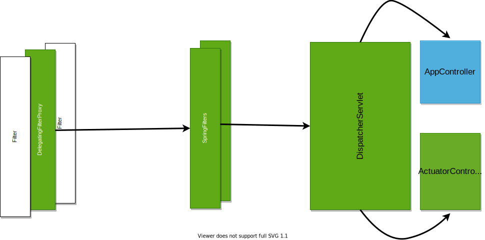

# Spring Security Architecture 


### Links
*	https://medium.com/geekculture/spring-security-authentication-process-authentication-flow-behind-the-scenes-d56da63f04fa
*   https://springbootdev.com/2017/08/23/spring-security-authentication-architecture/ 

## Architecture




## Authentication flow Architecture


* Step 1: 
	* `AuthenticationFilter` intercepts the authentication requests. 
	* It creates the `Authentication` object  and puts `credentials` in it. 
	* delegates the call to `AuthenticationManager`'s `authenticate( )`method by passing the `authentication` object 
* Step 2: 
	* `AuthenticationManager` finds out the right `AuthenticationProvider` using `supports()` method, who can support the requested Authentication type. 
	* delegates the call to `Authenticationprvider`'s `authenticate()` method and passes teh `authentication` object.
* Step 3:
	* `AuthenticationProvider` asks the `UserDetailService` to return the user instance from the system 
	* once it receives the response `AuthenticationProvider` verifies the user and here authentication happens 
	* if the authentication is successful , it returns the `Principal` object based on found `UserDetail`
	* If the authentication is not successful it will trow exception 

	**Note:** 
	* `Authentication` object which is the result of a successful authentication is put in a `ThreadLocal` variable. So that all other classes can read it from there.

	For Remember Me flow  thsi object is put somewhere else via anotehr suitable filter  

	* `AuthenticationContext` holds the `Authentication` object. Before authentication the object contains the `credential` ; after succesful authentication it contains the `Principal` 


## Authentication 
* `WbSecurityConfigurerAdapter` is our entry point for all configurations 
* `AuthenticationManager` class allows applications to configure Authentication Related settings 
* we need to use `AuthenticationManagerBuilder` to construct `AuthenticationManager`. Sample code may look like
````java
@Configuration
@EnableWebSecurity
public class ApplicationSecurityConfig extends WebSecurityConfigurerAdapter {

Autowired
	PasswordEncoder passwordEncoder; 
	@Override
	protected void configure(AuthenticationManagerBuilder auth) throws Exception {
		auth.inMemoryAuthentication()
		    .withUser("foo")
            // Note that we are encoding the password
            // If we do not encode spring will not accept the password
		    .password(passwordEncoder.encode("foo"))
		    .roles("USER") ;
		
	}

    @Bean
	public PasswordEncoder getPasswordEncoder() {
		return new BCryptPasswordEncoder(10);
	}
}
````

### PasswordEncoder
* Spring Security doe not allow us to deal with bare passwords and always recommends to use a  `PasswordEncoder`
    * You need to pass a `Bean` of type `PasswordEncoder`
    * You need to encode the password of the bean using the Password Encoder 
    * In case you do not want to use the encoder (NOT RECOMMENDED) you can try `NoOpPasswordEncoder` which is deprecated now
    ````java

    @Override
	protected void configure(AuthenticationManagerBuilder auth) throws Exception {
		auth.inMemoryAuthentication()
		    .withUser("foo")
            // Note that we are not encoding the password
		    .password("foo")
		    .roles("USER") ;
		
	}

    @Bean
	public PasswordEncoder getPasswordEncoder() {
		return NoOpPasswordEncoder.getInstance();
	}

    ```` 
### Annotations
#### EnableWebSecurity 
* To switch off the default web application security configuration completely you can add a bean with @EnableWebSecurity` 